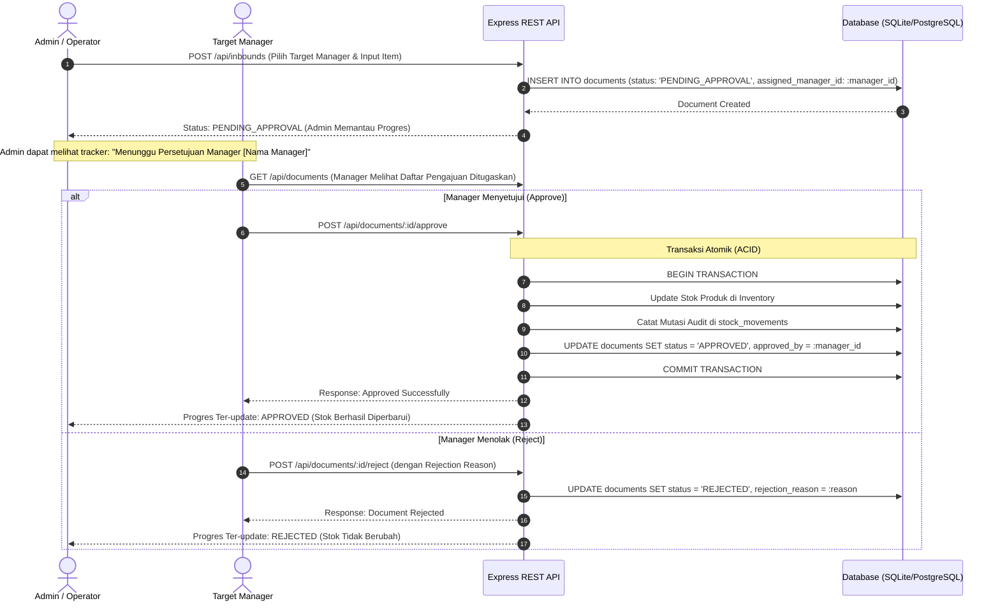
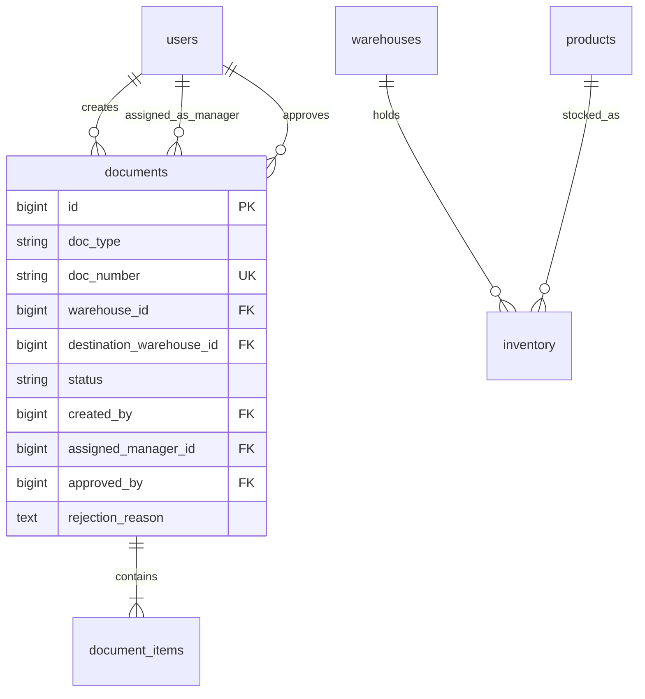

# STOCKFLOW PRO - System Architecture & Tiered Manager Approval Flow

Dokumentasi arsitektur sistem, skema database, alur persetujuan berjenjang (Admin Request ➔ Manager Approval), pelacak progres visual (*stepper*), dan kontrol akses untuk **STOCKFLOW PRO - Multi-Warehouse Inventory Monitoring System**.

---

## 1. Topologi Arsitektur & Alur Persetujuan Berjenjang

Dalam arsitektur enterprise STOCKFLOW PRO, pembuatan dokumen transaksi diajukan oleh **Admin/Operator** dan dialokasikan untuk disetujui (*approval*) oleh **Manager** target. Admin dapat memantau pelacak alur progres (*Workflow Stepper*) secara real-time.

```
+-----------------------------------------------------------------------------------+
|                            WORKFLOW PROGRESS STEPPER                              |
|                                                                                   |
|  [ 1. DRAFT ] ──> [ 2. PENDING MANAGER ] ──> [ 3. APPROVED ] ──> [ 4. RECEIVED ]  |
|   Admin Buat       Diajukan ke Manager       Disetujui Manager     Barang Diterima |
+-----------------------------------------------------------------------------------+
```

---

## 2. Sequence Diagram: Alur Persetujuan Dokumen (Admin ➔ Manager)



---

## 3. Matriks Hak Akses (RBAC Permission Matrix)

| Fitur / Endpoint API | SUPER_ADMIN | MANAGER | WAREHOUSE_ADMIN | OPERATOR | VIEWER |
| :--- | :---: | :---: | :---: | :---: | :---: |
| **Dashboard & DOI Analytics** | ✅ | ✅ | ✅ | ✅ | ✅ |
| **Lihat Stok & Catalog Produk** | ✅ | ✅ | ✅ | ✅ | ✅ |
| **Buat Request Dokumen (Inbound/Outbound/Transfer)** | ✅ | ❌ | ✅ | ✅ | ❌ |
| **Pantau Progres Tracker Dokumen** | ✅ | ✅ | ✅ | ✅ | ✅ |
| **Approve / Reject Dokumen (Approval Wewenang)** | ✅ | ✅ | ❌ | ❌ | ❌ |
| **Input & Approve Stock Opname** | ✅ | ✅ | ❌ | ❌ | ❌ |
| **Kelola Master Gudang & Produk** | ✅ | ✅ | ❌ | ❌ | ❌ |
| **Kelola User & Role** | ✅ | ❌ | ❌ | ❌ | ❌ |
| **Audit Logs & Export CSV** | ✅ | ✅ | ✅ | ❌ | ❌ |

---

## 4. Entity Relationship Diagram (ERD)


